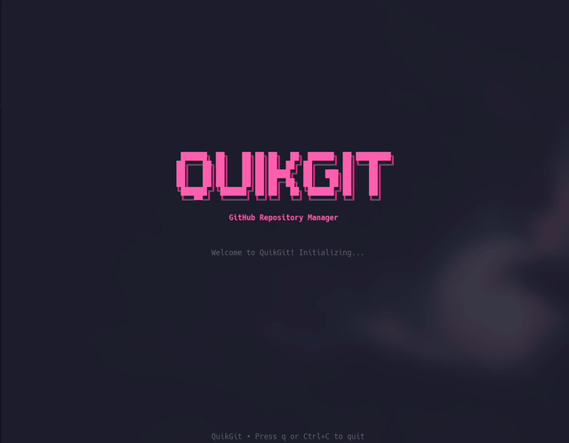

# QuikGit

[](https://golang.org/)
[](https://github.com/lvcasx1/quikgit/releases)
[](LICENSE)
[](https://aur.archlinux.org/packages/quikgit)

A powerful Terminal User Interface (TUI) for GitHub repository management that streamlines the process of discovering, cloning, and setting up projects in your local development environment.

<div align="center">
  
</div>

## Features

### **Seamless Authentication**
- **Personal Access Token**: Simple token-based authentication via TUI
- **Secure Token Storage**: Safely store and manage access tokens locally
- **Session Persistence**: Stay logged in between sessions

### **Powerful Repository Discovery**
- **Advanced Search**: Search by name, language, topics, and more
- **Smart Filtering**: Filter by user, organization, or specific criteria  
- **Real-time Results**: Instant search with pagination support
- **Rich Information**: View stars, forks, languages, and last updated

### **Efficient Multi-Repository Cloning**
- **Parallel Processing**: Clone multiple repositories simultaneously
- **Real-time Progress**: Enhanced progress tracking with Bubbletea v1+ and custom plugins
- **Smart Conflict Handling**: Handle existing directories gracefully
- **SSH & HTTPS Support**: Choose your preferred cloning method
- **Advanced Progress Bars**: Modern, responsive progress indicators with Bubbletea plugins

### **Automatic Dependency Installation**
- **Language Detection**: Automatically detect project types
- **Smart Installation**: Run appropriate dependency managers
- **Concurrent Processing**: Install dependencies for multiple projects
- **Error Handling**: Continue processing even if some installations fail

### **Modern Terminal Interface**
- **Responsive Design**: Adaptive layouts that scale to any terminal size
- **Enhanced Interaction**: Full keyboard navigation with intuitive shortcuts
- **Rich Visual Elements**: Beautiful components with smooth animations
- **Plugin Architecture**: Extensible UI components built with Bubbletea plugins
- **Bubbletea Framework**: Powered by the latest Bubbletea v1+ with advanced features

### **Modern Architecture**
- **Elm Architecture**: Built on The Elm Architecture pattern via Bubbletea
- **Component-Based**: Modular UI components with Bubbles library
- **State Management**: Predictable state updates with immutable data flow  
- **Custom Plugins**: Extended Bubbletea with specialized components
- **Smooth Animations**: Fluid transitions powered by Harmonica spring physics

### **Supported Project Types**

| Language | Files | Commands |
|----------|-------|----------|
| **Go** | `go.mod`, `go.sum` | `go mod tidy`, `go mod download` |
| **Node.js** | `package.json` | `npm install` / `yarn install` |
| **Python** | `requirements.txt`, `Pipfile`, `pyproject.toml` | `pip install`, `pipenv install`, `poetry install` |
| **Ruby** | `Gemfile` | `bundle install` |
| **Rust** | `Cargo.toml` | `cargo build` |
| **Java** | `pom.xml`, `build.gradle` | `mvn install`, `gradle build` |
| **C++** | `CMakeLists.txt` | `cmake`, `make` |
| **C#** | `*.csproj`, `*.sln` | `dotnet restore`, `dotnet build` |
| **PHP** | `composer.json` | `composer install` |
| **Swift** | `Package.swift` | `swift build` |
| **Dart** | `pubspec.yaml` | `flutter pub get` |

## Installation

QuikGit is available through multiple package managers and platforms for easy installation:

### macOS (Homebrew)

```bash
brew tap lvcasx1/tap
brew install quikgit
```

### Linux

#### Arch Linux (AUR)
```bash
# Using yay
yay -S quikgit-bin

# Using paru  
paru -S quikgit-bin

# Manual AUR installation
git clone https://aur.archlinux.org/quikgit-bin.git
cd quikgit-bin
makepkg -si
```

#### Ubuntu/Debian (.deb packages)
```bash
# Download and install DEB package
curl -LO https://github.com/lvcasx1/quikgit/releases/latest/download/quikgit_linux_amd64.deb
sudo dpkg -i quikgit_linux_amd64.deb

# For ARM64 systems
curl -LO https://github.com/lvcasx1/quikgit/releases/latest/download/quikgit_linux_arm64.deb
sudo dpkg -i quikgit_linux_arm64.deb

# Install dependencies if needed
sudo apt-get install -f
```

#### Red Hat/Fedora/CentOS (.rpm packages)
```bash
# Download and install RPM package
curl -LO https://github.com/lvcasx1/quikgit/releases/latest/download/quikgit_linux_amd64.rpm
sudo rpm -i quikgit_linux_amd64.rpm

# Or using dnf/yum
sudo dnf install https://github.com/lvcasx1/quikgit/releases/latest/download/quikgit_linux_amd64.rpm
```

### Docker

```bash
# Run QuikGit in a container
docker run -it --rm -v $(pwd):/workspace ghcr.io/lvcasx1/quikgit:latest

# Pull specific version
docker pull ghcr.io/lvcasx1/quikgit:v1.0.0
```

### Manual Installation

#### Binary Download
```bash
# Linux AMD64
curl -LO https://github.com/lvcasx1/quikgit/releases/latest/download/quikgit-linux-amd64.tar.gz
tar -xzf quikgit-linux-amd64.tar.gz
sudo mv quikgit /usr/local/bin/

# macOS AMD64
curl -LO https://github.com/lvcasx1/quikgit/releases/latest/download/quikgit-darwin-amd64.tar.gz
tar -xzf quikgit-darwin-amd64.tar.gz
sudo mv quikgit /usr/local/bin/

# macOS ARM64 (Apple Silicon)
curl -LO https://github.com/lvcasx1/quikgit/releases/latest/download/quikgit-darwin-arm64.tar.gz
tar -xzf quikgit-darwin-arm64.tar.gz
sudo mv quikgit /usr/local/bin/

# Windows (download .zip from releases page)
```

#### Build from Source
```bash
# Requires Go 1.21+
git clone https://github.com/lvcasx1/quikgit.git
cd quikgit
go build -o quikgit ./cmd/quikgit
sudo mv quikgit /usr/local/bin/
```

### Available Platforms

| Platform | Architecture | Package Format | Status |
|----------|-------------|----------------|---------|
| **Linux** | AMD64, ARM64 | `.tar.gz`, `.deb`, `.rpm` | ✅ |
| **macOS** | AMD64, ARM64 | `.tar.gz`, Homebrew | ✅ |
| **Windows** | AMD64, ARM64 | `.zip` | ✅ |
| **Docker** | Multi-arch | Container | ✅ |
| **Arch Linux** | AMD64, ARM64 | AUR Package | ✅ |

## Quick Start

### Step 1: Launch QuikGit

```bash
quikgit
```

### Step 2: First-time Authentication

On first run, QuikGit will guide you through authentication:

1. **Select "Authenticate with GitHub"** from the main menu
2. **Enter your Personal Access Token** when prompted
   - Create one at: https://github.com/settings/tokens/new
   - Required scopes: `repo`, `read:user`, `read:org`
3. **Token is validated and stored securely** for future use

### Step 3: Start Using QuikGit

**After authentication:**
1. **Search Repositories**: Use the search interface to find repositories  
2. **Select and Clone**: Choose repositories and let QuikGit handle cloning and setup
3. **Automatic Setup**: Dependencies are installed automatically based on project type

## Keyboard Shortcuts

### Global
- `q` / `Ctrl+C`: Quit application
- `Esc`: Go back to previous screen  
- `F1` / `?`: Show help
- `Tab`: Navigate between fields
- `Enter`: Confirm/Select

### Search Interface
- `Ctrl+L`: Select language filter
- `Ctrl+S`: Change sort options
- `Tab`: Switch between input fields

### Repository Lists
- `Space`: Toggle selection
- `a`: Select all repositories
- `d`: Clear all selections
- `j/k` or `↑/↓`: Navigate items
- `Enter/n`: Open repository in browser
- `c`: Clone selected/current repository

### During Operations
- `d`: Toggle detailed output view
- `Ctrl+C`: Cancel ongoing operations

## Configuration

QuikGit stores configuration in `~/.quikgit/config.yaml`:

```yaml
github:
  prefer_ssh: false
  ssh_key_path: ~/.ssh/id_rsa
  default_user: ""
  default_org: ""

clone:
  concurrent: 3
  use_current_dir: true
  create_subdirs: false
  default_path: ~/projects

install:
  enabled: true
  concurrent: 3
  timeout_minutes: 10
  skip_on_error: false
  auto_install: true

ui:
  theme: default
  animations_enabled: true
  animation_speed: normal
  component_style: modern
  color_scheme: adaptive

defaults:
  search_sort: stars
  search_order: desc
  results_per_page: 30
  preferred_auth: https
```

### Environment Variables

- `QUIKGIT_CONFIG`: Path to custom configuration file
- `QUIKGIT_DEBUG`: Enable debug logging

## Usage Examples

### Basic Repository Search
```bash
quikgit
# 1. Select "Search repositories"
# 2. Enter search terms
# 3. Select repositories
# 4. Press Enter to clone
```

### Command Line Options
```bash
# Show version
quikgit --version

# Use custom config
quikgit --config /path/to/config.yaml

# Enable debug mode
quikgit --debug

# Show help
quikgit --help
```

## Development

### Prerequisites
- Go 1.21 or later
- Git
- Make (optional)

### Key Dependencies
- [Bubbletea v1+](https://github.com/charmbracelet/bubbletea) - TUI framework
- [Bubbles](https://github.com/charmbracelet/bubbles) - UI components
- [Lipgloss](https://github.com/charmbracelet/lipgloss) - Styling library
- [Harmonica](https://github.com/charmbracelet/harmonica) - Animation engine

### Building

```bash
# Clone the repository
git clone https://github.com/lvcasx1/quikgit.git
cd quikgit

# Install dependencies
go mod download

# Build for current platform
make build
# or
go build -o quikgit ./cmd/quikgit

# Run tests
make test
# or
go test ./...

# Build for all platforms
make cross-compile
```

### Development Workflow

```bash
# Format code
make fmt

# Lint code  
make lint

# Run tests
make test

# Run all checks
make check

# Development build with debugging
make dev

# Run development version
make run-dev
```

### Bubbletea Plugin Architecture

QuikGit extends Bubbletea with custom plugins for enhanced functionality:

#### Custom Components
- **Enhanced Progress Bars**: Multi-stage progress tracking with animations
- **Dynamic Tables**: Sortable, filterable repository listings
- **Modal Dialogs**: Elegant confirmation and error dialogs
- **Search Components**: Real-time search with auto-completion
- **Status Indicators**: Live status updates with visual feedback

#### Plugin Development
```go
// Example custom component using Bubbletea
type CustomComponent struct {
    model tea.Model
    style lipgloss.Style
    animation harmonica.Animation
}

func (c CustomComponent) Update(msg tea.Msg) (tea.Model, tea.Cmd) {
    // Handle updates with Elm Architecture pattern
}
```

## License

This project is licensed under the MIT License - see the [LICENSE](LICENSE) file for details.

## Contributing

We welcome contributions! Please see our [Contributing Guide](CONTRIBUTING.md) for details.

### Ways to Contribute
- Report bugs
- Request features
- Improve documentation
- Submit pull requests
- Star the repository

## Acknowledgments

QuikGit is built with amazing open-source libraries:

- [Bubbletea](https://github.com/charmbracelet/bubbletea) - Modern TUI framework with The Elm Architecture
- [Bubbles](https://github.com/charmbracelet/bubbles) - Common UI components for Bubbletea
- [Lipgloss](https://github.com/charmbracelet/lipgloss) - Style definitions for terminal applications  
- [Harmonica](https://github.com/charmbracelet/harmonica) - Spring animation library for smooth transitions
- [go-github](https://github.com/google/go-github) - GitHub API client
- [go-git](https://github.com/go-git/go-git) - Pure Go Git implementation

## Statistics

- **Languages Supported**: 15+
- **Package Managers**: 10+
- **Platforms**: Linux, macOS, Windows
- **Architectures**: AMD64, ARM64

## Roadmap

- [x] **Advanced Components**: Implemented custom Bubbletea plugins for better UX
- [x] **Progress Enhancement**: Modern progress tracking with Bubbles components and animations
- [x] **UI/UX Improvements**: Responsive design with Lipgloss styling and Harmonica animations
- [ ] GitHub Enterprise support
- [ ] GitLab and Bitbucket integration
- [ ] Custom project templates
- [ ] Repository history and favorites
- [ ] Team collaboration features
- [ ] Plugin system
- [ ] Shell completion
- [ ] Man page documentation

## Support

- [Documentation](https://github.com/lvcasx1/quikgit/wiki)
- [Issue Tracker](https://github.com/lvcasx1/quikgit/issues)
- [Discussions](https://github.com/lvcasx1/quikgit/discussions)
- Email: support@quikgit.dev

## Metrics


---

*Streamline your GitHub workflow, one repository at a time.*